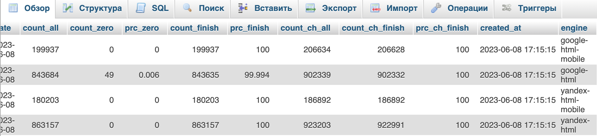
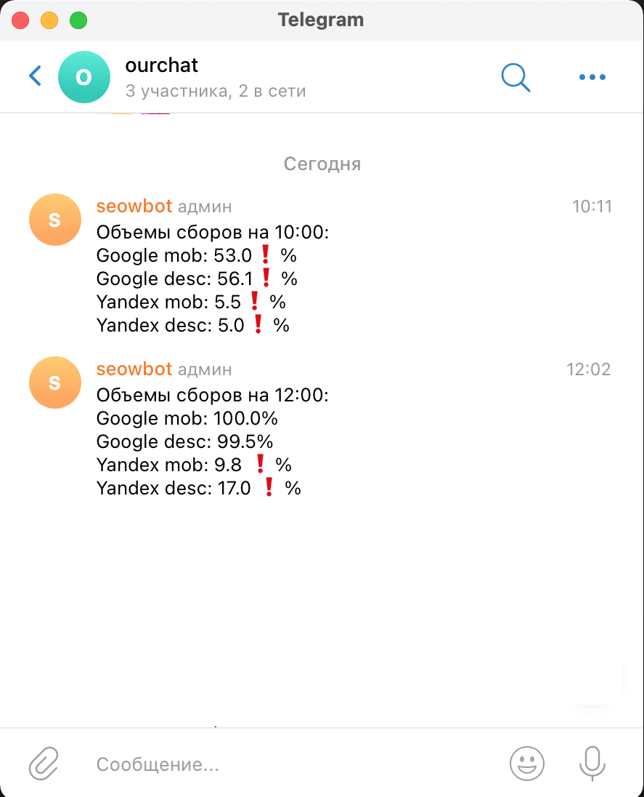

Привет, меня зовут **Алина** 👋

Учусь на курсе  


**Fullstack разработчик на Python**
___
 

**задача от компании SEOWORK📝**


---
**Задание📝:**

Необходимо из базы данных (MySQL) , которая расположена на сервере 


БД выглядит следующим образом:



Из БД нужно получить определенные данные (за текущую дату и за разный период времени) и отправлять 2 раза в день(по расписанию) при помощи телеграм-бота в телеграм-чат в формате:




**Для запуска проекта необходимо🛠️:**

1. Клонировать репозиторий 

    ➡️  [Github repository](https://github.com/Nimalia/DataSenderBot.git)

2. Установить виртуальное окружение
    ```bash 
    python3 -m venv venv
    ```

    ```bash 
    source ./venv/bin/activate
    ```
3. Установить `requirements.txt`
    ```bash 
    pip install -r requirements.txt
    ```


**Проект🛠️:**


### **Заметки🛠️:**

1. По телеграм-боту нам нужно:
- bot token (BotFather вам его пришлет)
- chat id (id чата можно найти в настройках, либо есть спец боты, которые вам его выведут)

Вашего созданного бота необходимо добавить в группу/канал.

2. К БД подключаемся при помощи ```` mysql.connector.connect```` 
Обязательно уделите внимание правильным логину/паролю/<u>названию базы данных</u>.

3. Ваш ip адрес,с которого вы будете запускать код, должен получить разрешение на соединение от сервера, на котором размещена БД

4. Стоит обратить внимание на текущее время на самом сервере, чтобы верно выставить расписание 

______
***VPS🛠️*** 

Помимо этого кода у компании существует еще один питоновский код, который собственно и формирует БД. 

Соответственно, необходимо, чтобы на VPS параллельно работали 2 кода. 

Я впервый раз столкнулась с хостингом/сервером/vps, поэтому оставляю здесь информацию по паралельному запуску, которая мне очень помогла.

Я пользовалась терминалом в самом облаке, читала, что можно через ```PuTTY /SSH /Docker``` и тд

с помощью 
```bash 
    сd /...
```
попадаем в папку где располагается ```файл.py```

```bash
python3 -m venv venv
```
```bash
source venv/bin/activate
```
```bash
pip install -r requirements.txt
```
При помощи ```nohup``` можем запустить первый процесс: 

```bash
nohup python3 код1.py &
```
```bash
Cntrl+C
```
Запускаем второй процесс:
```bash
nohup python3 код2.py &
```

Также можно все это сделать при помощи :

➡️  [System.D](https://cyber-x.ru/создаем-systemd-юнит-unit-на-примере-telegram-бота/)

В статье все хорошо описано. Добавлю,что в ```ExecStart``` 
нужно сначала указать путь  ```venv/bin/python3```, а потом уже путь до ```код1.py```
```bash
ExecStart=/myproject/venv/bin/python3 /myproject/код1.py
```

Юниты можно редактировать:
```bash
Sudo systemctl edit —full datasender.service
```
```bash
cntrl+X
```
```bash
Y
```
```bash
Enter
```

 *💡Совет:* Если что-то не получается с VPS , то не стесняйтесь обратиться в поддержку, у [beget](https://beget.com/ru) она отличная, без нее бы не справилась


----
```` Спасибо за уделенное время! 🙏 ````

___


[](https://github.com/anuraghazra/github-readme-stats)